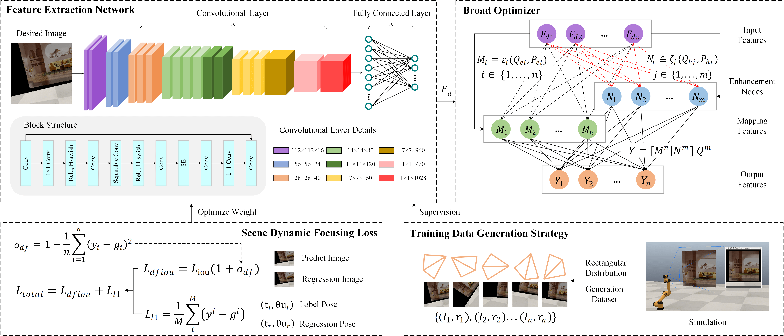

# Visual Servoing for Robotic Arm with Broad Optimization and Scene Dynamic Focusing Mechanism 

Code for paper Visual Servoing for Robotic Arm with Broad Optimization and Scene Dynamic Focusing Mechanism 

## Environment
Python 3.9, PyTorch 2.3.0, cuda 12.7, CoppeliaSim 4.7.0

## Others
